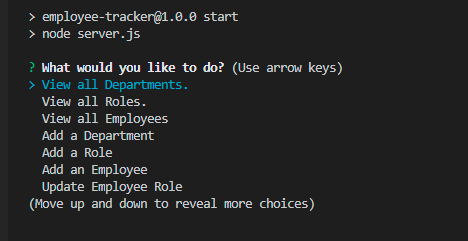
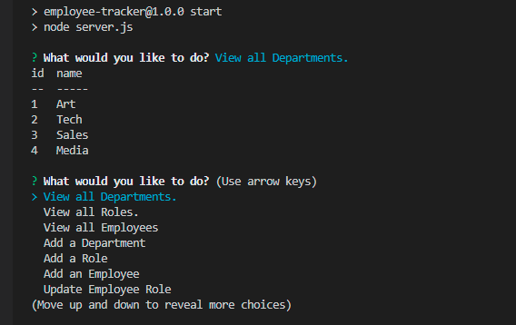

# Employee Tracker

## Description

This is a command-line application which allows the user to track and update all the employee information inside a company. 

## Installation

In order to install the application, clone this repository then open it in Vs Code. Open the terminal, then use the command "npm i" to install all the necceassry packages. Next, copy the seeds and schema files into your MySql Workbench. Provide your MySql server data into the connection.js file located in the config folder.

## Usage
Run 'npm start' on the terminal to begin the queries.

## Screenshots

## Demo

A video demo of the application may be found here

https://drive.google.com/file/d/1a3pDzgYWCLjNEZ4jtZV1mLK94Lvjhncz/view

## License

